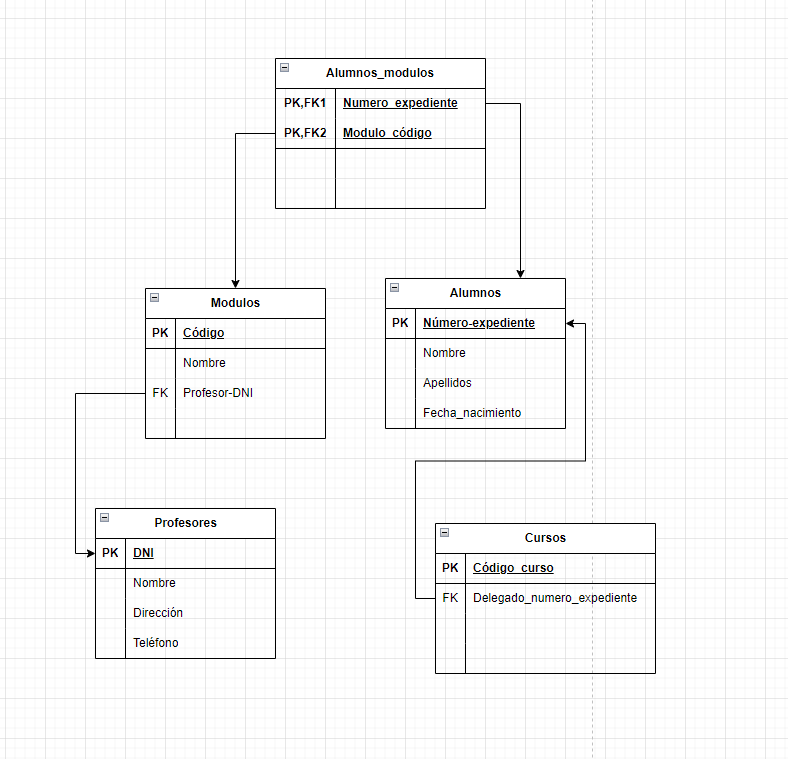
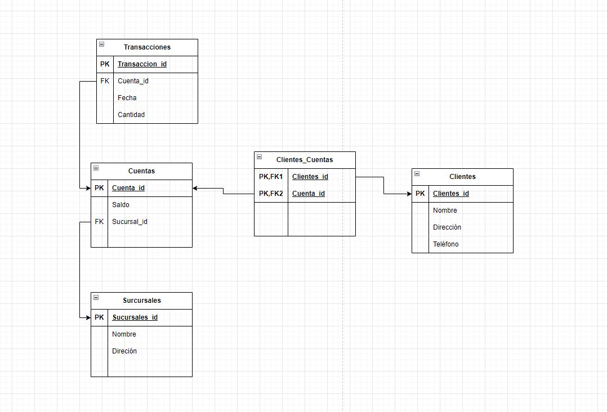
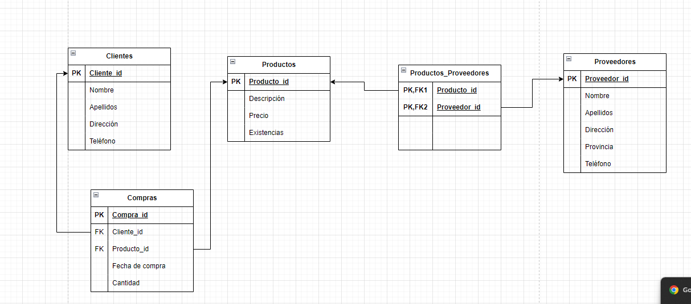
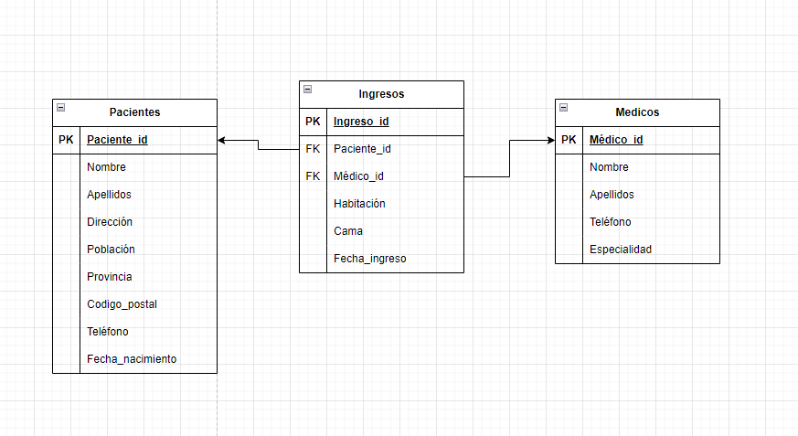
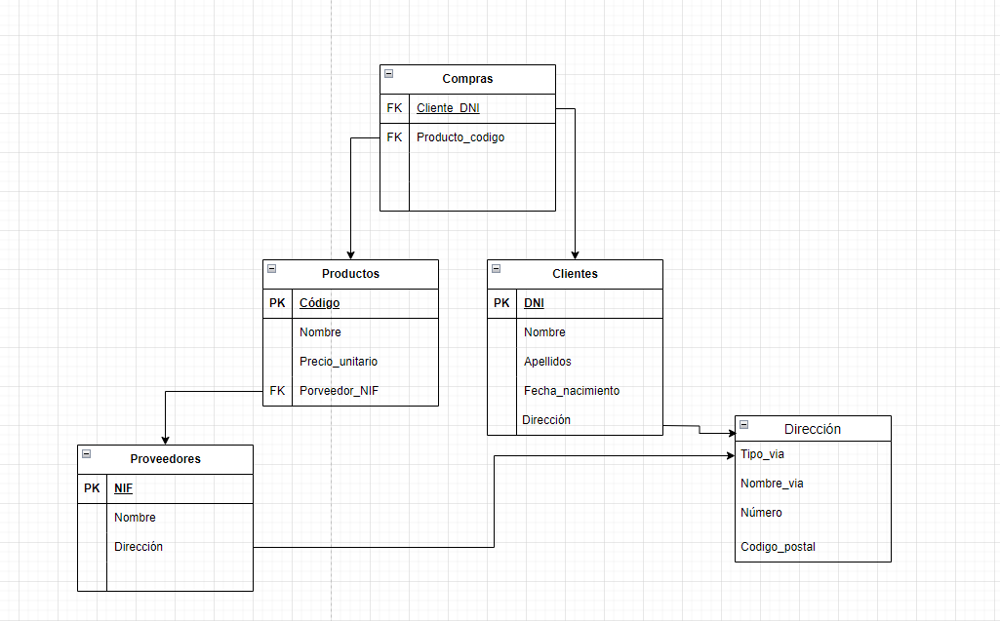

# Modelo Relacional

Este repositorio contiene los ejercicios relacionados con el modelo relacional. A continuación, se presentan los ejercicios con sus respectivas imágenes:

## Ejercicio 1

## Ejercicio 2

## Ejercicio 3

## Ejercicio 4

## Ejercicio 5
